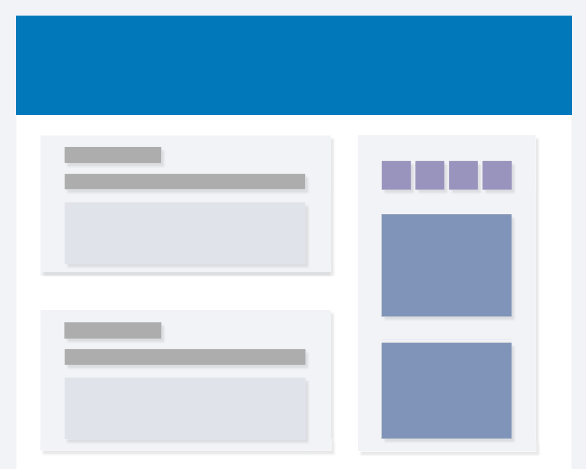
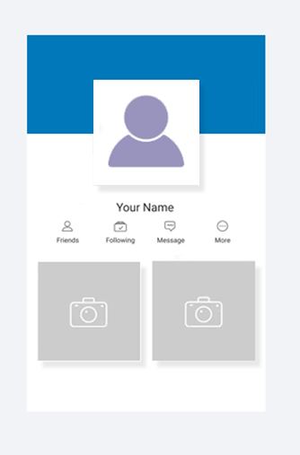
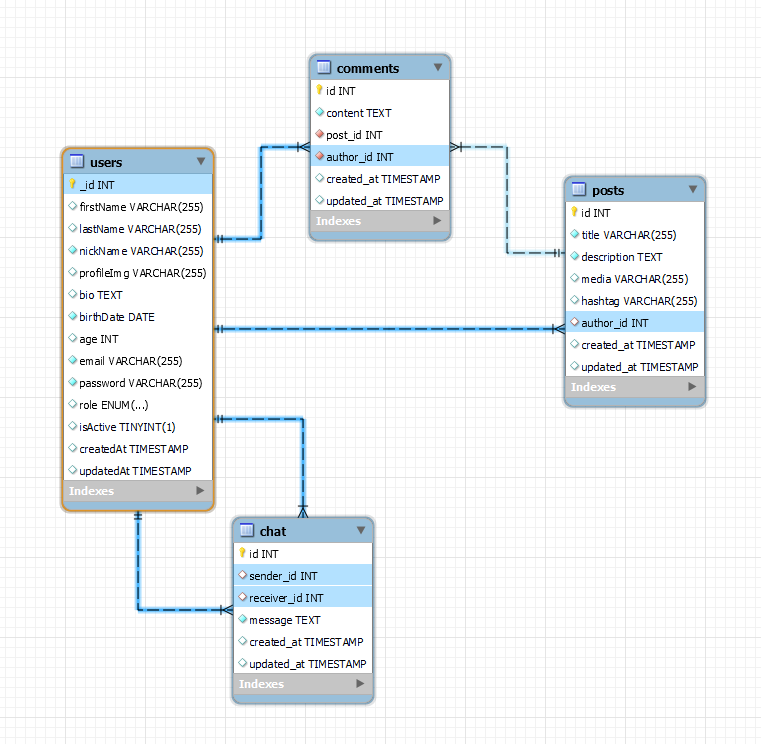

# Social Network📢



<details>
  <summary>Content 📝</summary>
  <ol>
    <li><a href="#objective">Objective</a></li>
    <li><a href="#about-the-project">About the project</a></li>
    <li><a href="#stack">Technologies used</a></li>
    <li><a href="#diagram-bd">Diagram</a></li>
    <li><a href="#Local-installation">Installation</a></li>
    <li><a href="#endpoints">Endpoints</a></li>
    <li><a href="#contribuciones">Contribuciones</a></li>
    <li><a href="#contacto">Contacto</a></li>
  </ol>
</details>

## Objective 🎯
This project has the objetive of building the necessary API for managing a Social Network using Express and mongoose technology.

## About the project📑

This GeeksHub's assignment has the primary objective of learning to work with Express + Mongoose technology to build the structure needed for the database of a social website, and deploy it into fl0.


In this project I've created different seeders (to test the funcionality) and the controllers needed for the assignment. 
In this social network you can register (using your email and a nickname) and you can create new posts, aside from looking other people's posts and give or take a like from it.



Other funcionalities included for the superadmin are deleting users, updgrading roles and selecting users by email.

[fl0 deployment](https://socialnetwork-dev-ntsh.2.ie-1.fl0.io/api/healthy)


## Technologies used 💻
<div align="center">
<a href="https://www.expressjs.com/">
    
</a>
<a href="https://nextjs.org/">
    
</a>
<a href="https://www.mongodb.com/es">
    
</a>
<a href="https://developer.mozilla.org/es/docs/Web/JavaScript">
    
</a>
<a href="https://www.npmjs.com/package/nodemon">
    
</a>
<a href="https://www.npmjs.com/package/cors">
    
</a>
<a href="https://www.npmjs.com/package/@faker-js/faker">
    
</a>
<a href="https://jwt.io/">
    
</a>
<a href="https://www.npmjs.com/package/dotenv">
    
</a>
<a href="https://www.npmjs.com/package/bcrypt">
    
</a>
<a href="https://git-scm.com/">
    
</a>
<a href="https://www.github.com/">
    
</a>
 </div>


## DB Diagram📉



## Local installation🔨
1. Clone the repository:

	`Git Clone https://github.com/JesusMatinezClavel/GeeksHub_FifthAssignment_SocialNetwork.git`

2. Change directory 

    ` $ cd GeeksHub_FifthAssignment_SocialNetwork `

2. Install the dependencies

    ` $ npm install `

3. Create the file `.env` from `.env.sample` and change the values to your needs:

    Port where the server will be:

        PORT_URI=

    Token's secret:

        JWT_SECRET=

4. Conect our repository with the database

    `$ npm run dev`

5. Execute the seeders

    ` $ npm run seed`

7. Import the ThunderClient collection from: 

    `./src/database/HTTP`

## Endpoints🚩
<details>
<summary>Endpoints</summary>

- AUTH
    - REGISTER

            POST localhost:4000/api/auth/register
        body:
        ``` js
                {
                  "firstName": "Jesús",
                  "lastName": "Martínez-CLavel Vallés",
                  "nickName": "xuss",
                  "profileImg": "./img/default-ProfileImg.png",
                  "bio": "Xuso, un apasionado estudiante de programación en constante búsqueda de desafíos y aprendizaje",
                  "birthDate": "1992-06-04",
                  "email": "xuso@email.com",
                  "passwordBody": "aA123456"
                }
        ```

    - LOGIN

            POST localhost:4000/api/auth/login 
        body:
        ``` js
                {
                  "email": "user@user.com",
                  "password": "Pwd12345"
                }
        ```

    - LOGOUT

            POST localhost:4000/api/auth/logout


- SUPERADMIN

    - Get All Users

            GET localhost:4000/api/users?limit&page

    - Get User by Email

            POST localhost:4000/api/users?email=user@user.com

    - Update User Role

            Put localhost:4000/api/users/:id/role
        body:
        ``` js
                {
                  "role": "user"
                }
        ```
    - Delete User

            DELETE localhost:4000/api/users/:id

- USERS
    - Get Own Profile

            GET localhost:4000/api/users/profile

    - Update Own Profile

            PUT localhost:4000/api/users/profile
        body:
        ``` js
            {
              "firstName": "",
              "lastName": "",
              "nickName": "",
              "profileImg": "",
              "bio": "",
              "email": "",
              "password": "",
              "passwordCheck": ""
            }
        ```
    - Follow

            PUT localhost:4000/api/users/follow/?nickname

    - Unfollow

            PUT localhost:4000/api/users/unfollow/?nickname


- POSTS
    - Create New Post

            POST localhost:4000/api/posts/
        body:
        ``` js
            {
              "title": "post 01",
              "media": "",
              "description": "description of the post 01"
            }
        ```
    - Get My Posts

            GET localhost:4000/api/posts/own

    - Get All Posts

            GET localhost:4000/api/posts

    - Get Posts by Post ID

            GET localhost:4000/api/posts/:id

    - Get Posts by User ID

            GET localhost:4000/api/posts/user/:id

    - Delete Post by PostId

            DELETE localhost:4000/api/posts/:id

    - Update Post

            PUT localhost:4000/api/posts
        body:
        ``` js
            {
              "id":"22",
              "title":"post 01",
              "description":"",
              "media":""
            }
        ```
    - Add/Remove Like

            PUT localhost:4000/api/posts/like/:id


</details>

## Contributions🤘
Sugestions are always welcomed!

You can do it both ways:

1. Create an issue
2. Create a fork of the repository
    - Create new branch
        ```
        $ git checkout -b feature/nombreUsuario-mejora
        ```
    - Commit the changes
        ```
        $ git commit -m 'feat: mejora X cosa'
        ```
    - Push the branch
        ```
        $ git push origin feature/nombreUsuario-mejora
        ```
    - Open a Pull Request

## Contact📧
<a href = "mailto:jmcvalles@gmail.com"></a>
<a href="https://www.linkedin.com/in/jes%C3%BAs-mart%C3%ADnez-clavel-vall%C3%A9s-913294108?lipi=urn%3Ali%3Apage%3Ad_flagship3_profile_view_base_contact_details%3BtQmk%2FVrTShiKcofYcK6uYg%3D%3D" target="_blank"></a> 
</p>